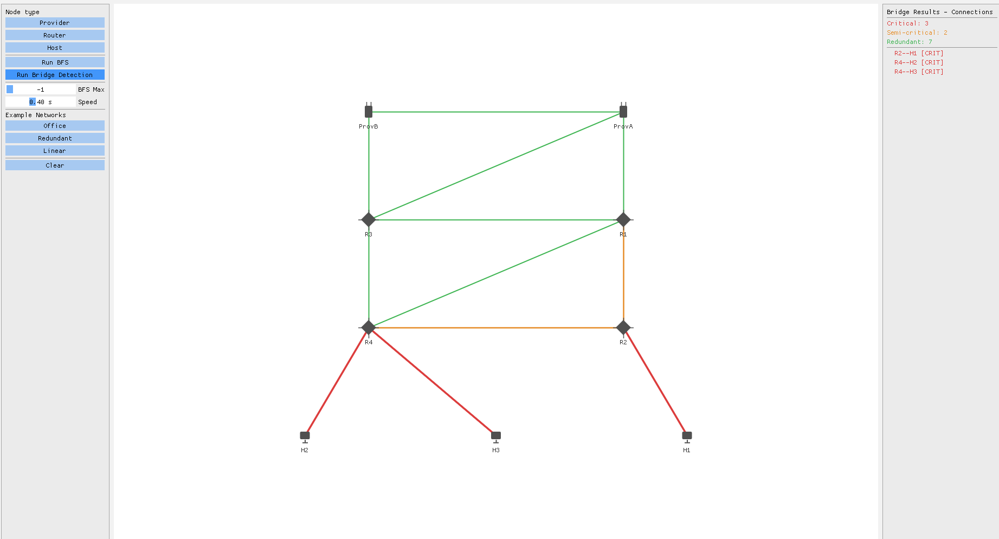

# Network Reachability Analysis

An interactive tool for building and analyzing computer networks. It visualizes multi-source BFS reachability from providers and extends Tarjan's bridge detection with a custom three-way edge criticality classification — identifying which connections are critical, but also which ones are  keeping the network from becoming more fragile.



The project is split into two components:
- **GUI application** — interactive graph editor with step-by-step BFS and bridge animations
- **CLI demo** — runs the full analysis pipeline on built-in example networks with a formatted report

**Tech focus:**  
C++17 • Dear ImGui • GLFW • OpenGL3 • CMake

**Algorithm focus:**  
Multi-source BFS • DFS • Tarjan's Bridge Algorithm • Edge Criticality Classification

---

## Features

### Connection Criticality Analysis

Standard bridge detection gives a binary answer: an edge is either a bridge or it isn't. This project extends that with a three-level classification that captures how much each connection actually matters to network resilience.

Every connection (edge) is classified into one of three categories:

**Critical** — an edge whose removal immediately disconnects at least one host from all providers. These edges are always bridges and are the network's hard breakpoints.

**Semi-critical** — an edge whose removal doesn't break anything immediately, but makes the network more fragile by increasing the number of critical bridges. 

**Redundant** — an edge whose removal has no effect on the critical structure. The network is equally resilient without it.

This gives operators a clear priority order: fix Critical connections first, protect Semi-critical ones second, and treat Redundant ones as safe to cut.

### Reachability Analysis (BFS)

Multi-source BFS launches simultaneously from all providers and classifies each host as:
- **Reachable** — connected to at least one provider within the hop limit
- **Underserved** — reachable, but path length exceeds the configured maximum
- **Unreachable** — no path to any provider exists

The animation propagates the BFS wave level by level, coloring each provider's subtree distinctly. Routers remain neutral gray as shared infrastructure.

---

## Build

**Requirements:** C++ compiler with C++17 support, CMake 3.16 or newer, OpenGL (system-provided). GLFW and Dear ImGui are fetched automatically via CMake FetchContent.

```bash
git clone git@github.com:andja45/network-reachability-analysis.git
cd network-reachability-analysis
```

GUI application:
```bash
cmake -B build -DBUILD_GUI=ON
cmake --build build --target gui_app
./build/gui/gui_app
```

CLI demo:
```bash
cmake -B build
cmake --build build --target core_demo
./build/core/core_demo
```

---

## Usage

### Canvas

| Action | Result |
|--------|--------|
| Select node type (left panel), then left-click empty space | Place a node |
| Left-click a node, then left-click another node | Connect them with an edge |
| Left-click and drag a node | Move it |
| Right-click a node | Delete node and all its edges |
| Right-click an edge | Delete that edge |

Deleting any node or edge clears the current analysis — re-run when ready.

### Controls (left panel)

- **Provider / Router / Host** — select node type for placement; click again to deselect
- **Run BFS** — run reachability analysis and animate the BFS wave
- **Run Bridge Detection** — classify all connections and animate the result
- **BFS Max hops** — maximum hop count for underserved classification; `-1` means unlimited
- **Speed** — animation step delay
- **Office / Redundant / Linear** — load a built-in example network
- **Clear** — reset the canvas

### Reading the results (right panel)

**BFS view** — total, reachable, unreachable, and underserved host counts with per-host detail.

**Bridge view** — edge counts by criticality and a list of each critical and semi-critical connection by name.

### Color reference

| Color | Meaning |
|-------|---------|
| Node color (BFS) | Nearest provider |
| Gray node | Router (shared, provider-neutral) |
| Orange node | Underserved host (beyond max hops) |
| Red node | Unreachable host |
| Red edge | Critical connection |
| Orange edge | Semi-critical connection |
| Green edge | Redundant connection |
